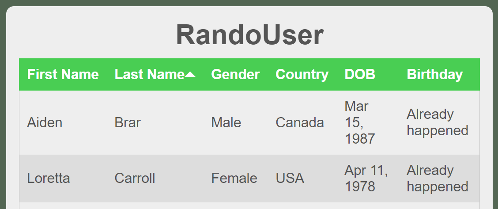
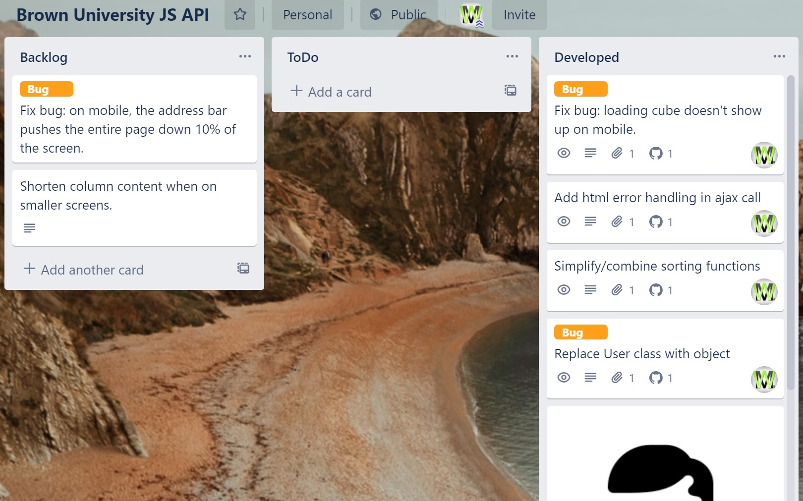

#  RandoUser

<i>Brown University JS API Project</i>

  <a href="https://vindennl48.github.io/RandoUser/">
    
    See it in action!
  </a>, 
  <a href="https://trello.com/b/9g3Db4re/brown-university-js-api">
    
    View Trello board
  </a>

  

  

## Features

- **Display Users**
  - Displays a list of `20` random users from the [randomuser.me](https://randomuser.me) api.
- **Show Birthday**
  - Displays if the user's birthday already happened, is today, or has yet to happen for the current year.
- **Sort by column**
  - By clicking on a column header, the user can alternate between ascending and descending order for each column.
- **Status / Loading Cube**
  - A CSS cube that lets the user know data is being fetched from the api.  This is in case the api takes longer than expected, the user will know that something is being processed in the background.
- **Mobile friendly**
  - Resizing to a smaller screen size will adjust the table to a more manageable state for a better UI experience.
  
## Libraries

- **jQuery**
  - Only used for the Ajax functionality.  jQuery has a very easy to use ajax function and, for sake of time, was the easiest way to implement this functionality.
- **moment.js**
  - Used for easy output of date format.  The date format coming from [randomuser.me](https://randomuser.me) was in an ISO date format.  We want to have a user-readable date format and this library was the easiest way, for sake of time, to accomplish that task.
  
## Improvements

If I had more time, things I would like to change.
- **Provide an even better mobile experience**
  - I am happy with the way the mobile version came out, however, there is always room for improvement.  I would like to see a vertical table with all the data stacking on-top of eachother instead of having to scroll left and right to see the data for each user.  Possibly have each user by first/last name displayed and when clicked on, a card appears under that user's name with the remaining data.  This will give some compactness to the table on mobile without restricting the user from all of the information.  This might be a perfect use of a `React` application.
- **Remove jQuery completely**
  - As useful as this library can be, it is a big library that needs to be downloaded.  This can add time to load a webpage and when working with bigger sites, this can have an adverse affect on user experience.  The more we can reduce the amount of code, the faster and more optimized our projects can be.
- **Remove moment.js**
  - There are ways to manipulate `Date()` in JS to accomplish the same goal as this library is being used for.  I have not actually done this before, so this was the quickest/easiest way at the time.  Just as with the bullet point above, it would be benificial to remove this library in lieu of a few functions written in vanilla JS.
